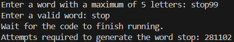

# Random Letter Solver

This program generates random letters until they match a user-provided word. It iteratively creates random words of the same length as the target word and counts how many attempts it takes to find an exact match.

## How it works
1. The program will ask you to enter a word with a maximum of 5 letters.
2. Necessary checks will be performed to ensure that the input contains only letters, without any other symbols.
3. If the input is not valid, the program will prompt you to enter a word again.
4. When a valid word is entered, the program will start generating random letters to form words.
5. Once your word is formed, the program will notify you and indicate how many words were generated to match the entered word.

## Contributing
Contributions are welcome! Please follow these steps:
1. **Fork the Repository**
2. **Create a Feature Branch (`git checkout -b feature-branch`)**
3. **Commit Your Changes (`git commit -m 'Add some feature'`)**
4. **Push to the Branch (`git push origin feature-branch`)**
5. **Open a Pull Request**
